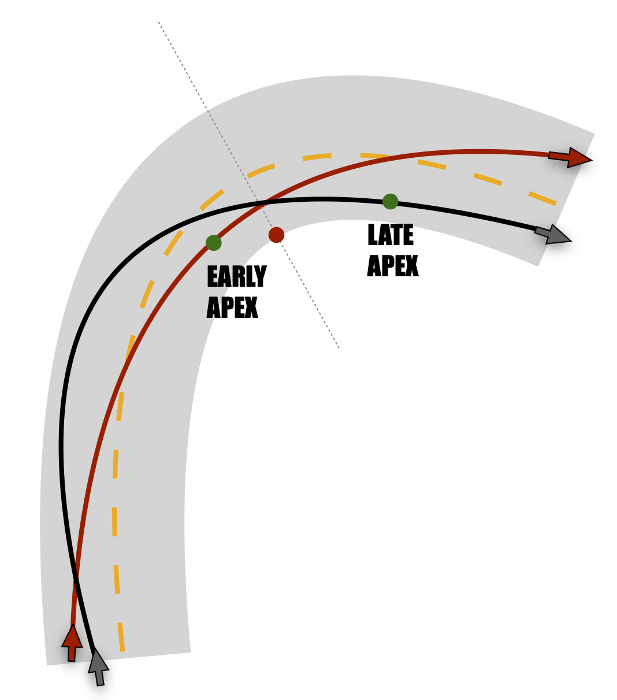

# *Bike handling*: what is it and why should anyone care?

I think that *bike handling* in road cycling is a challenging and fascinating research topic. However, I noticed there are at least two points of view, and mixing them up is not going to help, so let's be sure we got 'em first:

* 🚴 __Sport science__: from this point of view, bike handling is synonym for *technical skills*, which translates in the ability of one-hand riding, effective and considerate obstacle avoidance, stoppie-wheelie tricks, navigating the pack, etc. 
* 🚲🧑‍🤝‍🧑 __Vehicle dynamics__: from this point of view, bike handling has more to do with the performance of the bike-rider coupling, i.e.: the ability that the riders have to consciously explore the limits of their bike.  

The first point of view quickly translates in a safer ride, but it's hard to find the association with cycling performance. For some, *bike handling* is about *dealing with the unexpected*, but for me it's more about *knowing very well what to expect*. Hence, I support the second point of view, and I never mix *bike handling* with *technical skills*. 

The possible reasons why *bike handling* is poorly studied might be: 

* It is not perceived as important as other physiological abilities
* It is difficult to assess due to logistic and safety reasons

In this blog post I will try to give an idea about:

* The impact that *bike handling* can have on the overall cycling performance
* The tools we have to assess *bike handling* with 'cost effective' instrumentation

# High-speeds = high-stakes

As it often happens, the best riders can stand out from the group because their uncommon abilities. However, displaying uncommon *bike handling* abilities can be very dangerous. The limits of the bike-rider performance are dictated by physics, which places rigid constraints to the kind of accelerations (and decelerations) that the bike can sustain. High speeds are not dangerous *per se*, but because they can result in unsustainable accelerations. Uncommon *bike handling* abilities therefore require uncommon confidence. 

Both braking and cornering require different coordinated actions: pulling the brake levers, steering, and changing body position to lean into the corner. While braking can lead to strong longitudinal decelerations, cornering can lead to strong lateral accelerations. Forces needed to complete these actions are generated at the tire-road interface, and therefore depend upon the tire-road friction: the higher the friction, the higher the forces that the tire can afford. 

It's easy to experience high-speeds while going downhill. In the next figure, the sequence of actions required during corner negotiation are represented for a generic downhill high speed corner. As you can see, a change in the body position is required to use the body as an air brake, and then to negotiate the corner. Although the single actions might be the same, every rider can choose a particular timing and a particular strategy for the execution.

<figure align="center">

<figcaption>Sequence of actions while negotiating a high-speed corner in road cycling.</figcaption>
</figure>

# *Bike handling* and racing lines

The trajectories that the riders follow while they negotiate a corner are often called *racing lines* (a term inherited from motor sports). We can broadly classify two cornering strategies, which lead to different trajectories. Before getting to them, we need to define an important term: the *apex*. In the following picture you can see that the *geometric apex* is the point where the path has the minimum cornering radius. 

<figure align="center">

<figcaption>The geometric apex.</figcaption>
</figure>

But we can also detect an *apex* on the racing line, which is usually defined as: '*the point on the inside portion of a corner that a rider passes closest to*'. A trajectory apex can be defined as being an earlier apex or later apex with reference to the *geometric apex*, and they are presented in the following figure.

<figure align="center">

<figcaption>Early VS late apex.</figcaption>
</figure>

* Late apex: The 'late apex' strategy is typically characterized by a hard braking action somehow separated from a following cornering action. The resulting *racing line* ensure a good line of sight and enough space for braking in emergency. This trajectories are usually characterized by low entry speeds and fast exit speed.
* Early apex: The 'early apex' strategy usually means less margin for error, as there is a very narrow line of sight and not a lot of space for adjusting the speed. A great advantage of this strategy is that, compared to the 'late apex', you can keep higher average speeds and you reduce the total travelled distance. 

## Is there an 'optimal' strategy?

This is the million dollar question. Albeit, by definition, there will always be an 'optimal' strategy (i.e., the one that can lead to the best time performance), there is no evidence that can support a single strategy consistently across every possible condition. I tried to collect here a number of possible variables that can impact the 'optimal' cornering strategy. In short, we can say that the 'optimal' strategy it's individual and highly dependent on the race and environmental conditions. 

* 🧑‍🤝‍🧑 Individuality: the 'optimal' strategy depends on the individual's engine. A good sprinter with a lot of power available might prefer a 'late apex' strategy, because he/she can start delivering the power sooner. 
* ☔ Environmental conditions:
  * Road conditions, with particular reference to the road surface and the resulting road-tire friction coefficient. In these regards, rain might be a game changer, especially in races with extended technical sections. A wet road of course is more slippery and hard braking actions and high lateral accelerations might not be sustainable. 
  * Resistive forces are mainly represented here by the air resistive forces. They can have a lot of influence, but it depends upon they are due to front wind or tail wind. Front wind can help you brake more effectively before the corner and accelerate more efficiently after. Therefore, the front wind might support a 'late apex' strategy. On the other hand, tail wind can make it braking problematic, and accelerating after a corner might be even more demanding. Tail wind before the corner would suggest that an 'early apex' strategy is better.   
  * Slope is another great game changer 
* 🔋 Race conditions: 
  * Energy preservation strategies (i.e., the pacing strategies) that the riders are trying to implement can impact the 'optimal' strategy. It is known that strong accelerations that require massive power outputs are mainly supported by the anaerobic alactic metabolic pathway. These big bursts might not be ideal during long races, but they might be required during a breakaway. Again, higher average speeds and early apex strategy is advocated for those who don't like to sprint out after the corners. Indeed, corners are often used by the riders to briefly recover and get ready for the next most demanding race sections.  
  * What's next? The position and direction of the next corner also affects the choice of the *racing line*. A fast exit speed might be useless if there is another corner that requires attention. Also, the infinite number of variations in road geometry and topology might require very different and hybrid approaches.
  * Road width is also of high importance, since it narrows down the space available on the road to brake and turn in. 

# Evaluating *bike handling*

## The gg diagram

The gg diagram is widely used in motor racing to depict the accelerations of a vehicle in the road plane. In the following picture the structure of the gg diagram is presented. On the x-axis, lateral accelerations are reported. On the y-axis, longitudinal accelerations are reported. These accelerations are the highest during strong sprint efforts, rapid changes in road slope and hard braking. 

<figure align="center">

<figcaption>The gg diagram.</figcaption>
</figure>

## How to read the gg diagram

🧭 If you look at the picture above, you'll notice that a wind rose is included. Cardinal directions will be used here to better explain how to read the diagram. 

*East* and *West* represent high lateral accelerations, typically high during high-speed corners. At *North*, we have strong accelerations, typically high when there is a sudden decrease in road slope or there is a strong sprinting action going on. At *South*, we have large decelerations, hence index of rapid increase in road slope or hard braking actions. Combinations are of course possible: at *South/West* and *South/East* we see combinations of lateral and negative accelerations (e.g., cornering and braking together), at *North/West* and *North/East* we see combinations of lateral and positive accelerations (e.g., cornering and accelerating together). 

So we introduced the gg diagram as a tool to describe riding behavior, but what about performance? Well, evaluating the gg diagram in isolation for a single rider in a single corner or race section might lead to erroneous conclusions. If possible, the gg diagram should be used to compare riders or settings. Below, I provide an interesting comparison between bikes (bicycles) (red line), 125 cc motorcycles (blue line) and 1000 cc Super Bikes (yellow line). The motorcycling data has been kindly provided by Prof. [F. Biral](https://webapps.unitn.it/du/en/Persona/PER0004552/Pubblicazioni) and they have been collected on the [Mugello](https://en.wikipedia.org/wiki/Mugello_Circuit) circuit during testing sessions. Cycling data has been provided by a professional cyclist at the Giro d'Italia 2020.  

<figure align="center">

<figcaption>How an actual gg diagram looks like: 1000 cc bikes VS 125 cc bikes VS cyclist.</figcaption>
</figure>

It is pretty apparent that motorcycles can produce higher accelerations in both longitudinal and lateral directions. As you can see, heavy 1000 cc bikes can sustain also strong combinations of lateral and longitudinal accelerations. 

# Practical considerations

Knowing what the 'optimal' trajectory might be and actually following it are two very different things. All the blog posts I read about the topic share one tip in common, and it sounds pretty much like: 'you need to relax'! Yep, easy to say, but hard to execute. Descents are often cold, windy and repulsive: it's no joke. Road surface is never perfect: pockmarked surfaces are a nightmare for cyclists! Putting in practice what guidelines suggest it's hard, if not impossible. However, visualization and mental preparation can be a very useful tool. In the end, *bike handling* is about knowing very well what is going to happen, and being able to leverage this knowledge to gain competitive advantage. 

What about the equipment? Well, my current understanding and opinion is simple: that the best equipment for getting the most of your *bike handling* abilities is the one that can give you more confidence. This is true for the bike frame, the wheels, the tires and the brakes. The unstable bike that will start wobbling at 60 kph will not give you the right confidence for extreme trajectories. Brakes are of key importance: I might say that disk brakes usually have a more regular response than rim brakes. So it's not all about the braking power. Many cyclists prefer the 'late apex' strategy in every condition, and this is because it requires a single strong braking action and no concomitant leaning/cornering action. To better explain this situation, I use again the gg diagram.

On the following gg diagram (yes, some imagination is required), the two different cornering maneuvers of two hypothetical riders are represented. While approaching the corner, the two riders have constant velocity, hence they are in the middle of the diagram. While approaching the corner the 'black arrow rider' brakes and turns with two very distinct actions: first a strong deceleration heading South in our wind rose is measured, second a strong lateral acceleration heading East is measured. The result is the typical ✝️ shape. While approaching the corner the 'red arrow rider' starts braking and cornering at the same time: a first deceleration heading South progressively heads SE, then E and finally the center of the diagram again. The resulting shape looks like a 🦋 wing or a 👂 lobe. 

<figure align="center">

<figcaption>Comparing two cornering strategies on the gg diagram.</figcaption>
</figure>

Typically, the less experienced riders are those who are not willing to brake and lean into the corner at the same time, hence they display a cross shape in the gg diagram (at least, this is the lesson from motor sports...). Experts are those able to explore large portions of the gg diagram, and they can draw a nice 🦋. Can disk brakes help the riders feeling more stable and therefore complete the corners with a different strategy? This is still at a speculative level. 

# Additional readings

This blog is the result of few years spent studying cycling trajectories. I got the privilege to collaborate with great minds in the field of sports science and vehicle dynamics, and we eventually got to publish few scientific papers on the topic. 

These blog posts have been a great source of inspiration: 

* [Romain Bardet on Rouler](https://www.rouleur.cc/blogs/the-rouleur-journal/romain-bardet-down-to-earth)
* [Chad Haga on Cycling News](https://www.cyclingnews.com/blogs/chad-haga-1/chad-haga-blog-joy-relief-and-grief-in-verona/)
