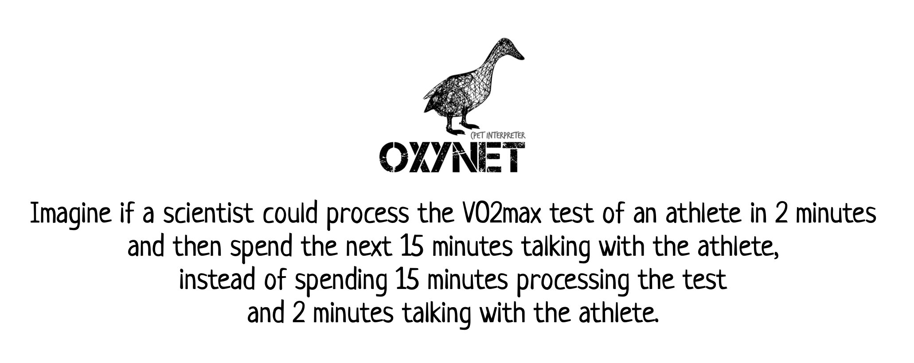

<figure align="center">

<figcaption>&mdash; Inspired by Lynda Chin, from Eric Topol's book Deep Medicine <cite>Chapt. 2</cite></figcaption>
</figure>

# The *chasm* between AI and clinical implementation

The number of applications of AI to health care and health-related fields has been exponentially growing in the last decade. However, of all the algorithms developed, a minor fraction of them is actually implemented in the clinical practice. This gap is also known as AI *chasm*. AI chasm is what separates a technology available to a very advanced readiness level from a technology which is deployed and used in the clinical practice. In this brief contribution, I would like specifically to discuss about the AI chasm in the context of cardiopulmonary exercising test data interpretation.  

## Why is this chasm occurring

### Explanatory power

A new algorithm might never be used in the real practice in spite of scientific studies proving its accuracy. The main reasons is that accuracy is not the only objective that an AI system should have: __intelligibility__ is another very important one. It looks like clinicians are reluctant when it comes to try new algorithms that cannot provide explanations for the results. 

Arguably models can vary in complexity and structure. Multi-linear models are a prominent example in statistics, where the results of a fitting process can be used to understand the relative importance of all the input variables and how they interact to make the predictions. These models are relatively simple, as they include a limited number of parameters for every single variable. On the other side of the spectrum, deep learning techniques are widely adopted to extract patterns and features from complex data arrangements. But are we able to understand all the patterns the model has learnt, given than often these models contain millions of parameters? Can they tell us something about the underlying physiological process we are trying to create a model for?

The number of parameters in a model per-se does not indicate good or bad explanatory ability. In the case of deep learning, there are models that can show layer by layer what features have been isolated, and this helps understanding the defining characteristics of the input data. This is common in image or shape isolation/recognition problems, but it is far more complex when multivariate time-series data are considered. 

### Transparency and adaptability

Deconstructing a model and translate in plain language the characteristics of the extracted features is problematic. Indeed, most of the models are very good in making predictions, but very inefficient when it comes to provide explanations. This is not the only reason why an AI chasm is occurring. Other important elements in the diffusion of a new model are __transparency__ and __adaptability__. On one hand, transparency is about the data used to train the model: is that representative of the population the clinician is targeting? Open and transparent information about the dataset used to train the model could give clinicians more confidence when using the model in their unique day-to-day practice. On the other hand, adaptability is about the degree at which a given model can be personalized by the end-user. This personalization can be in terms of data but also in terms of interpretations and perhaps beliefs. 

### Cognitive load

Importantly, some AI model implementations suffer from excessive false alarms and complex explanatory visualizations. There is no doubt that AI models that put additional cognitive load (i.e., the mental effort required to perform a task) on the clinicians will always find a very hard way to production. It is not a secret that cognitive overload in clinical practice is highly associated with bad health care services. There is no need for an AI that can provide assistance with data interpretation at the cost of an overloaded or overly stressed clinician. Any AI system that can actually decrease the cognitive load of a clinician should be prioritized.   

# The cardiopulmonary exercise test challenge

## Threshold detection: cognitive or merely computational?

The [cardiopulmonary exercise test](https://en.wikipedia.org/wiki/Cardiac_stress_test) is the gold-standard for the evaluation of an individual aerobic fitness. Data consist in breath-by-breath values of different ventilatory variables such as: oxygen uptake ($VO_2$), exhaled carbon dioxide ($VCO_2$), and ventilation ($VE$). Clinicians interpret the data with knowledge, experience and beliefs. Interpreting the result of a test can sometimes take considerable cognitive toll. I believe, however, that there are instances where cognitive process can be merely considered *computational*, and this is the example of ventilatory threshold detection. This task is often times only a matter of detecting braking points and changing patterns in ventilatory variables, or at least this is the way it is presented in the scientific literature on the topic. It is undeniable that, in many cases, a human does not need to possess a profound knowledge about physiology to detect breaking points in ventilatory variables. This is the main reason why automatic methods for ventilatory threshold detection have been developed in the last four decades. These methodologies might or might not have explanatory power.

## Simple models: explanatory but not accurate

Automatic methods which implement complex computations are poorly adopted in the clinical practice. On the contrary, a simple methodology developed in the 80s that implement linear regression is the most adopted algorithm. This model is thought to have physiological roots, as it looks specifically and intentionally for ventilatory thresholds in correspondence of breaking points in the $VCO_2$ vs $VO_2$ and $VE$ vs $VCO_2$ relationships. These breaking points underlie a more profound meaning at physiological level, as they can be considered hallmarks for exercise intensity domain boundaries. Applying this regression model to the clinical practice requires however deploying it on a processing unit. Once the model is finally tested, deployed, and put into production, can show limitations. Limitations are mostly due to unwanted portions of data polluting the input. It is soon pretty apparent that these models need some human cognitive load to select and pre-process only limited portions of the input data. 

* PRO: 
  * Profound physio roots (enhanced explanatory power)
  * Easy implementation (both development and deployment)
* CONS: 
  * Pre-process is needed (manual work and cognitive toll)
  * Sensitive to signal-to-noise ratio

## Deep learning models: accurate but not explanatory

Oxynet is a collection of deep learning algorithms conceived to decrease the cognitive load of the clinicians in the process of the cardiopulmonary test data. Oxynet explanatory power is still very low, but accuracy in ventilatory threshold determination is exceeding that of a human expert. 

* PRO: 
  * Improved accuracy and robustness to the noise
  * Decreased cognitive toll (entirely automatic) 
* CONS: 
  * Not explanatory
  * Complex implementation (especially deployment)

# Final thoughts

In the search for the perfect algorithm accuracy should not be the only goal. It is important to consider the ability to justify and explain the choices made by the model, and make the features extracted by the AI understandable for clinicians. Oxynet AI models have been conceived to alleviate the cognitive load associated with the determination of the ventilatory thresholds. 

In the development of such models, however, we make the dangerous assumption that ventilatory threshold detection is a merely computational process that requires no prior knowledge about human physiology. In this specific sub-task of cardiopulmonary test data interpretation there is increasing evidence suggesting that clinicians might be better off with the aid of an AI which can take care of the computational aspects. The lack of explanatory power is paid off by an increased accuracy and a decreased cognitive load. 

# Additional reading

* Aristidou, Angela, Rajesh Jena, and Eric J. Topol. "Bridging the chasm between AI and clinical implementation." The Lancet 399, no. 10325 (2022): 620.

* Holm, Elizabeth A. "In defense of the black box." Science 364, no. 6435 (2019): 26-27.

* Ehrmann, Daniel E., Sara N. Gallant, Sujay Nagaraj, Sebastian D. Goodfellow, Danny Eytan, Anna Goldenberg, and Mjaye L. Mazwi. "Evaluating and reducing cognitive load should be a priority for machine learning in healthcare." Nature Medicine (2022): 1-2.

* Watson, David S., Jenny Krutzinna, Ian N. Bruce, Christopher EM Griffiths, Iain B. McInnes, Michael R. Barnes, and Luciano Floridi. "Clinical applications of machine learning algorithms: beyond the black box." Bmj 364 (2019).