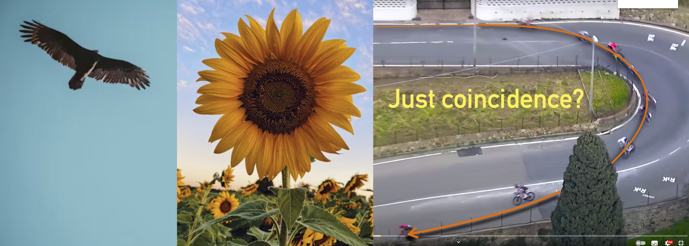

<figure align="center">

<figcaption>Fascinating trajectories in nature. An eagle soaring over a prey, the seeds of a sunflower, and a group of cyclists cornerning at the 2024 Milano-Sanremo race. </figcaption>
</figure>

# Trajectories in nature

What does an eagle that hunts a prey have in common with a sunflower? 🦅 🌻 Well, both the trajectory of the eagle and the disposition of the seeds of the sunflower seem to share the same mathematical structure: a spiral following a Fibonacci pattern. 

In nature, spirals come in many forms, but there isn't a clear classification for all of them. While some, like fern buds, are easily recognized as spirals, others aren't as obvious. What is both fascinating and evident, is that nature loves smooth transitions and graceful curves, and hates discontinuities, especially in movements. In other words: _Natura non facit saltus_ (Carl Linnaeus, _Philosophia Botanica_ - Chapt. 27).

Interestingly, humans have conceived and created spiral shapes that don't exist in nature. One such spiral is called the _clothoid_, and indeed isn't found in nature. In the present blog post, we introduce and discuss a fascinating question: **is there a case to be made that cyclists trace clothoids while descending?**

<figure align="center">

<figcaption>The trajectory of a cyclist on a descent, as captured with a drone during a (scientific study)[https://link.springer.com/article/10.1007/s12283-022-00386-1]. </figcaption>
</figure>

## A famous spiral in road and rail engineering 

To travel along a circular path, an object needs to be subject to a centripetal acceleration (for example: the Moon circles around the Earth because of gravity; a car turns its front wheels inward to generate a centripetal force).

If a vehicle traveling on a straight path were to suddenly transition to a circular path, it would require centripetal acceleration suddenly switching at the tangent point from zero to the required value; this would be difficult to achieve. Think of a train instantly moving from straight line to turning position, and the train-cars actually executing it, putting mechanical stress on the train's parts, and causing much discomfort to the passengers.

In the past, on early railroads, this instant application of lateral forces was not an issue since low speeds and wide-radius curves were employed (lateral forces on the passengers and the lateral sway was small and tolerable). As speeds of rail vehicles increased over the years, it became obvious that an easement is necessary, so that the centripetal acceleration increases gently (e.g. linearly) with the traveled distance. Given the expression of centripetal acceleration: 

$$a_c=v^2/r$$

the obvious solution is to provide an easement curve whose curvature: 

$$k=1/R$$

increases linearly with the traveled distance. Indeed, a spiral where the curvature increases linearly with the arc length is a _clothoid_, or a Euler's spiral. Nowadays, drawing clothoids instead of circles is a design choice made in road and rail engineering, particularly in designing curves and transitions. Indeed, the reason behind using clothoids comes down to providing a smooth transition between straight paths and circular curves.

## Of cycling and racing lines 

Human movement is all about optimization because it involves finding the most "convenient" way to plan and execute movement. In the context of movement, the human body possesses a high degree of redundancy. For instance: 1) there is an incredible number of joints in the human body, and the same end-point might be reached with a different combination of angular joint angles; 2) multiple motoneurons activate a single muscle, and multiple muscles can actuate a single articular joint, so muscle recruitment must consider the "biomechanical" convenience of the individual muscles (fiber typology, moment arm, position, speed of contraction, etc.); 3) on a higher level, a person might travel from point A to point B using different trajectories or a different distribution of intensity along the course (i.e., different pacing strategies). The list of examples could continue indefinitely.

<figure align="center">

<figcaption>Is there a better image to explain how humans are moving around?</figcaption>
</figure>

But what does "convenient" really mean? It could encompass different interpretations depending on the context. Generally, it's believed that humans seek to minimize energy consumption, perceived effort, or strike a balance between perceived and expected effort. The choices humans make during movement, whether it's reaching for a pen or completing a cycling trajectory, may involve a mix of conscious and unconscious factors. The true optimization goal of the human body remains a topic of debate and one of the most intriguing challenges in motor control studies.

Let's focus on cycling for now, considering an individual time trial as an example. In a race, riders strive to optimize their arrival time. However, not everyone competes with the intention to win or goes full throttle due to strategic considerations such as the general classification, team responsibilities, or a lack of interest in stage victory. Hence, we might ponder: is there a common factor that applies to everyone?

One common aspect often under scrutiny is the smoothness of the trajectory or its counterpart, the concept of jerk. Jerk, derived from acceleration, signifies the acceleration variation and can be calculated across various parameters such as body joint accelerations, torques, power output, and more. Cyclists executing abrupt movements tend to struggle with cornering effectively. Factors like rough road surfaces, wet wheel rims, sudden steering adjustments, and excessive reaction to bumps disrupt the fluidity of movements and cornering. By seeking seamless transitions between straight paths and curved trajectories, cyclists aim to minimise both performance time and jerk at the same time. This strategy promises the best overall performance, achieving a harmonious equilibrium among multiple factors, including risk and reward.

In discussions about racing lines, therefore, it's reasonable to consider that experienced cyclists might trace clothoids along their routes.

<figure align="center">

<figcaption>"The racing line, not only a matter of final time minimisation, but also comfort and risk. Clothoids are often used because they provide a gradual change in curvature, which helps minimize discomfort for the driver and reduce wear and tear on vehicles. Photo credits: Brian Snelson from Hockley, Essex, England, CC BY 2.0 &lt;https://creativecommons.org/licenses/by/2.0&gt;, via Wikimedia Commons"</figcaption>
</figure>

## Just a coincidence?

There seems to be something profound that links curves and trajectories in nature, not just a coincidence. From the arc of an eagle in flight to the spiral of a sunflower, these natural patterns hint at a fundamental relationship between form and function. Through the neverending renegotiation of tiny adjustments, human movements evolve and patterns such as cycling trajectories emerge. Those choices that promise greater success are embraced, learned, encoded in our neural circuitry, and eventually revisited. 

Human movement embodies an endless journey of exploration and discovery, delving into the depths of our existence. Yet, along this journey, some truths emerge as fundamental pillars of our ability to move: the intrinsic essence of movement itself is deeply rooted in the fabric of nature.

# Bibliography and additional insights

## Scientific papers:

* [Todorov E.](https://www.nature.com/articles/nn1309)
* [Todorov and Jordan](https://pubmed.ncbi.nlm.nih.gov/12404008/)
* [Bertolazzi et al.](10.1109/HISTELCON56357.2023.10365736)
* [Frego et al.](https://www.sciencedirect.com/science/article/pii/S0005109817304508)

## Practical application

"OK, Andrea, but please what do I need to know this for?" Well, let's assume you are collecting cycling GPS positions every second, how do you connect those points? Now, you should already now what I would suggest. Your best bet is to take the GPS points and fit them with clothoids. 

  