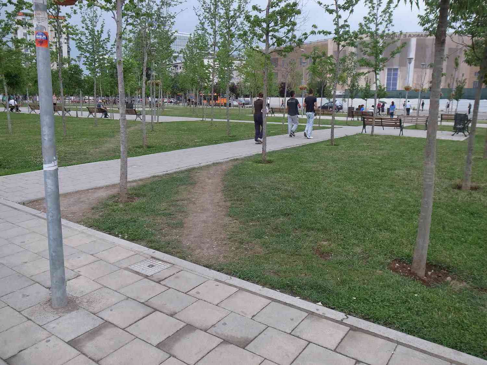

<figure align="center">

<figcaption>Photo by <a href="https://unsplash.com/@jluebke?utm_content=creditCopyText&utm_medium=referral&utm_source=unsplash">Justin Luebke</a> on <a href="https://unsplash.com/photos/person-in-yellow-coat-standing-on-top-of-hill-BkkVcWUgwEk?utm_content=creditCopyText&utm_medium=referral&utm_source=unsplash">Unsplash</a></figcaption>
</figure>

# Trajectories in nature

What does an eagle that hunts a prey have in common with a sunflower? 🦅 🌻 Well, both the trajectory of the eagle and the disposition of the seeds of the sunflower seem to share the same mathematical structure: a spiral following a Fibonacci pattern. 

In nature, spirals come in many forms, but there isn't a clear classification for all of them. While some, like fern buds, are easily recognized as spirals, others aren't as obvious. Interestingly, humans have created spiral shapes that don't exist in nature. This blog post looks at one such spiral called the _clothoid_, which isn't found in nature. 

It appears that nature favors smooth transitions and graceful curves, avoiding the introduction of discontinuities or cusps. In other words:

<figure class="quote">
  <blockquote> 
    Natura non facit saltus.
  </blockquote>
  <figcaption>
    &mdash; Carl Linnaeus <cite>Philosophia Botanica - chap. 27</cite>  </figcaption>
</figure>

In the present blog, we introduce and discuss a fascinating question. **Is there a case to be made that cyclists trace clothoids while descending?**

<figure align="center">

<figcaption>The trajectory of a cyclist on a descent, as captured with a drone during a (scientific study)[https://link.springer.com/article/10.1007/s12283-022-00386-1]. </figcaption>
</figure>

## Of railways and clothoids

To travel along a circular path, an object needs to be subject to a centripetal acceleration (for example: the Moon circles around the Earth because of gravity; a car turns its front wheels inward to generate a centripetal force).

If a vehicle traveling on a straight path were to suddenly transition to a circular path, it would require centripetal acceleration suddenly switching at the tangent point from zero to the required value; this would be difficult to achieve. Think of a train instantly moving from straight line to turning position, and the train cars actually doing it, putting mechanical stress on the train's parts, and causing much discomfort to the passengers.

In the past, on early railroads this instant application of lateral force was not an issue since low speeds and wide-radius curves were employed (lateral forces on the passengers and the lateral sway was small and tolerable). As speeds of rail vehicles increased over the years, it became obvious that an easement is necessary, so that the centripetal acceleration increases gently (e.g. linearly) with the traveled distance. Given the expression of centripetal acceleration: 

$$a_c=v^2/r$$

the obvious solution is to provide an easement curve whose curvature: 

$$k=1/R$$

increases linearly with the traveled distance. This is a _clothoid_, another name for the Euler spiral. Nowadays, drawing clothoids instead of circles is a design choice made in road and rail engineering, particularly in designing curves and transitions. Indeed, the reason behind using clothoids comes down to providing a smooth transition between straight paths and circular curves.

## Of cycling and racing lines 

Human movement is all about optimization because it involves finding the most "convenient" way to plan and execute movement. The human body possesses a high degree of redundancy. For instance: 1) there is an incredible number of joints in the human body, and the same end-point might be reached with a different combination of angular joint angles; 2) multiple motoneurons activate a single muscle, and multiple muscles move a single articular joint, so muscle recruitment must consider the "biomechanical" convenience of the individual muscles (fiber typology, moment arm, position, speed of contraction, etc.); 3) on a higher level, a person might travel from point A to point B using different trajectories or a different distribution of intensity along the course (i.e., different pacing strategies). The list of examples could continue indefinitely.

<figure align="center">

<figcaption>Is there a better image to explain how humans are moving around?</figcaption>
</figure>

But what does "convenient" mean? It might entail different things in different situations. It is usually believed that humans minimize energy consumption, perceived effort, or find a balance between the effort they perceive and the one they think they should perceive. Anyway, the choices that humans make when performing a movement, which might involve reaching out to grasp a pen or completing a cycling trajectory, might be done partly consciously and partly unconsciously. What the human body is truly trying to optimize for is currently debated and is one of the most exciting challenges in the field of motor control studies.

Let's stick to cycling though, with the example of an individual time trial. During a race, riders aim to optimize arrival time, but not all compete to win or go full throttle due to strategic reasons related to the general classification, team duties, or a lack of interest in stage wins. So, we might ask ourselves if there is a factor common to all.

One common element often considered is the smoothness of the trajectory or its inverse concept, the jerk. Jerk is calculated as the derivative of acceleration, representing the variation in acceleration, and can be computed for body joint accelerations and torques alike. Riders executing jerky movements are less likely to navigate corners effectively. Rough road surfaces, wet wheel rims, sharp steering adjustments, and overreacting to bumps are all factors that impede the smooth execution of actions and cornering.

<figure align="center">

<figcaption>"The racing line, not only a matter of final time minimisation, but also comfort and risk. Clothoids are often used because they provide a gradual change in curvature, which helps minimize discomfort for the driver and reduce wear and tear on vehicles. Photo credits: Brian Snelson from Hockley, Essex, England, CC BY 2.0 &lt;https://creativecommons.org/licenses/by/2.0&gt;, via Wikimedia Commons"</figcaption>
</figure>

## Practical application

OK, Andrea, but please what do I need to know this for? Well, let's assume you are collecting GPS positions every second, how do you connect those points? Now, you should already now what I would suggest. Your best bet is to take the GPS points and fit them with clothoids. 

## Additional (scientific papers) readings:

* [Todorov E.](https://www.nature.com/articles/nn1309)
* [Todorov and Jordan](https://pubmed.ncbi.nlm.nih.gov/12404008/)
* [Bertolazzi et al.](10.1109/HISTELCON56357.2023.10365736)
* [Frego et al.](https://www.sciencedirect.com/science/article/pii/S0005109817304508)

  