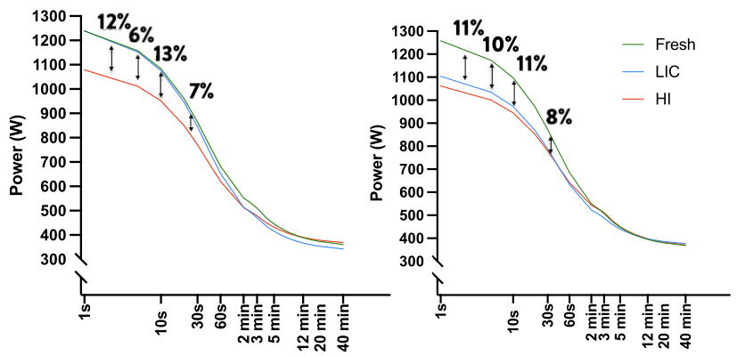

# An inspirational paper

In the last few days, a new-ish published paper ([Spragg et al. 2023](https://onlinelibrary.wiley.com/doi/full/10.1002/ejsc.12077)) caught my attention. The paper has been written by an esteemed research unit that includes eminent researchers in the field of endurance sports and power profiling in cycling. This study investigated the impact of prior work intensity on the power-duration relationship in professional cyclists. Fourteen cyclists underwent three power profile tests: one in a fresh state and two after different fatiguing protocols. The results suggest that the intensity of prior work, particularly for shorter-duration efforts, plays a crucial role in the downward shift of the power-duration relationship, highlighting the importance of considering work intensity beyond just total workload.

The following **Figure 1** is adapted from the original study, and highlights the meaning behind the downward shift in the maximal mean power values due to the "fatiguing" protocols. 

<figure align="center">
    
    <figcaption>Figure 1) Downward shifts in the power profile were expected and have been documented in fatiguing conditions (adapted from <a href="https://onlinelibrary.wiley.com/doi/full/10.1002/ejsc.12077">Spragg et al. 2023</a>). Is it possible at all to receive this info *during* exercise?. </figcaption>
</figure>

The main reason why I felt attracted by this publication is that it aligns perfectly, in my opinion, with the concept behind the *Athletica Workout Reserve*. As "fatigue" develops, the exercising maximal mean profile moves closer or away from the historical or "fresh" maximal mean power. Very briefly, the Athletica Workout Reserve does exactly that: it monitors the oscillations of an athlete's maximal mean power during exercise. 

# A very simple idea

The *Athletica Workout Reserve* is based on a very (very) simple idea. Actually, it might well represent the simplest model for exercise capacity that I am aware of. As written in **Figure 2**, if the minimal distance between the current maximal mean power and the historical maximal mean power can be used as a proxy for exercise capacity, then we can say that: *the exericse capacity is depleted and recovered at the pace of the rolling average of the power output that is closest to its historical maximum*. It might sound complicated, but this is the shortest and most generic version I could conceive. When the WR is 0% it means that there is a rolling average reaching the 100% of its historical maximum. That's it, nothing more nothing left. 

<figure align="center">
    
    <figcaption>Figure 2) Example of the fluctuations in Workout Reserve during a simulated HIT session. The minimum Workout Reserve (WR) is depicted in red. The red line follows the rolling average that is closest to its historical maximum. The thin gray lines are the rolling averages that are not limiting the exercise. In this example the minimum WR reaches 50%, which means that the rolling average closest to its maximum is at 50% of this maximum. Eventually, if the WR is 0%, it means that there is a rolling average reaching 100% of its historical maximum. Which rolling average exaclty? This information can also be retrieved with the WR. </figcaption>
</figure>

It must be noted that this concept can be applied broadly to different endurance activities, not only those that involve power measurements such as cycling and rowing. Indeed, in cycling, the power output is directly related to exercise intensity, so for running we should consider the running speed. The same concept is still valid for running speed profiles, albeit the downward shifts in the maximal mean speed profile are not documented, to my knowledge.   

# A real-time Garmin application

At Athletica there is no shortage of brain power. I was lucky enough to have a fan in Paul, and he involved Phil in the implementation of the WR concept on the [Garmin devices](https://apps.garmin.com/apps/c9a93545-7db0-4a1b-b955-21db19edbf9d?tid=1). The app is free to use, but you need a subscription to Athletica, which is also free for a trial. The only reason why the App needs Athletica is because Athletica can compute your power/speed profile in the way that can be digested by the WR algorithm. 

In **Figure 3** a picture taken on a Garmin running the App is presented. As you can notice, the value of the minimum WR is presented in %, along with a slider (available in "advanced" display modality). The % WR tells you how far you are from one of your maximal mean power points, whilst the slider tells you whether these points are those closer to the short-time/high-intensity domain ("S") or closer to the long-time/low-intensity domain ("L"). I find this pretty cool actually. 

<figure align="center">
    
    <figcaption>Figure 3) The meaning behind the numbers, in a snapshot taken during a training session (photo credits @<a href="https://twitter.com/TiredMomRuns">TiredMomRuns</a>). </figcaption>
</figure>

# Is an athlete always exhausted at WR=0%? 

No! Not necessarily. Two perspectives. 

1) As eloquently elucidated in **Figure 1** (again, adapted from [Spragg et al. 2023](https://onlinelibrary.wiley.com/doi/full/10.1002/ejsc.12077)), an athlete can be exhausted well before reaching the 100% of their maximal mean power. We should bear in mind that the maximal mean power is populated with the best data we have (e.g., in Spragg et al 2023, the authors talk about a "fresh" profile, and they adopted a technique that is *not* exactly the maximal mean profile, but this should not have a huge impact on the conclusions of this post...). This is due to the fact that "fatiguing" conditions might impair the ability of an athlete to push at their maximum limits for that specific time/intensity-domain. 

2) It might happen that the WR can fall below 0%, which means that a new record is established and that they have set a new maximal mean power for a specific time/intensity-domain. In this case, there is only a simple explanation: the reached maximal mean power during exercise is >100% of the previously known maximal mean power. It's no secret that the maximal mean power concept relies on maximum efforts to be included in the profile. 

# How can I use WR in training and racing? 

We still have limited experience on how to use the WR during exercise and racing. Some examples have been collected in a [blog post](https://athletica.ai/train-and-race-with-athleticas-workout-reserve-on-garmin/). It is all speculative at the moment, and very experimental.  

Whether this tool can be used to assess an athlete's "fatiguability" is an open question. What the preliminary results are suggesting together with the last available literature is that if an athlete is exhausted with WR>>0%, it means that they are likley pretty "fatigued", and they could not replicate their best maximum mean power for a specific time-domain. The great advantages of WR, is that: 1) this can be assessed in real-time, and 2) the specific time/intensity domain that lead to exhausiton can be revealed. 

All-in-all the WR holds some promise and, in my view, it aligns well with the rising concept of "durability" and "moving thresholds". Indeed, for WR, there are no thresholds at all, just upper limits made to be broken. 

# References, additional readings, and content

* On power profiling: [Leo et al. 2022](https://link.springer.com/article/10.1007/s00421-021-04833-y)
* On durability: [Maunder et al. 2021](https://link.springer.com/article/10.1007/s40279-021-01459-0)
* On downward shifting of maximal mean power in fatigued conditions: [Spragg et al. 2023](https://onlinelibrary.wiley.com/doi/full/10.1002/ejsc.12077)
* Rationale behind the Workout Reserve [Zignoli 2023, preprint](https://sportrxiv.org/index.php/server/preprint/view/244/version/308)
* On ventilatory threshold changes in fatigued conditions: [Gallo et al. 2024](https://link.springer.com/article/10.1007/s00421-024-05440-3)

* [HIIT Science blog on Workout Reserve](https://athletica.ai/athletica-workout-reserve-future-of-fitness/)
* How to use the [Workout Reserve Garmin App](https://athletica.ai/train-and-race-with-athleticas-workout-reserve-on-garmin/) in training and racing
* Check if you have a compatible device [here](https://forum.athletica.ai/t/garmin-connect-iq-workout-reserve-compatible-devices/1139)
* Download and install the app [here](https://apps.garmin.com/apps/c9a93545-7db0-4a1b-b955-21db19edbf9d)
* Report your experience [here](https://forum.athletica.ai/t/garmin-connectiq-workout-reserve-data-field/1039/269) 

# Little note on fatigue vs "fatigue"? 

The reason why I used the quotes for the word "fatigue" is bacause, to my knowledge, the downward shifts in maximum mean power have not been yet associated with standard markers of fatigue such as maximal voluntary contraction, etc.. I maintained the terminology adopted in the paper by Spragg et al. to ensure consistency. 