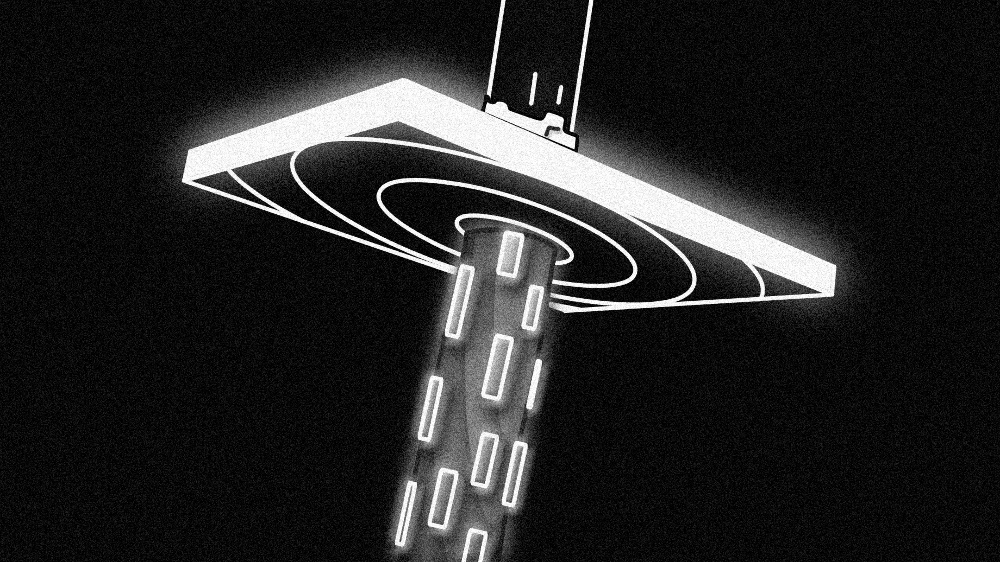

<figure align="center">

<figcaption>Photo by <a href="https://unsplash.com">Unsplash</a></figcaption>
</figure>

*This post is a placeholder — full content coming soon.*

# The descent from the Poggio

The **Poggio di San Remo** is the defining climb of [Milano-Sanremo](https://www.milanosanremo.it/percorso-milano-sanremo-2026/), the longest one-day Classic on the professional cycling calendar. At roughly 294 km, La Classicissima is a race of patience that explodes in the final kilometres. The Poggio rises just 162 m over 3.7 km at an average gradient of 3.7%, but its position — with less than 6 km to the finish — makes the descent that follows one of the most consequential in all of cycling.

<figure class="quote">
  <blockquote>
     The Poggio descent is where races are won and lost. It is not the steepest nor the longest, but it is the fastest and the most consequential.
  </blockquote>
</figure>

## Why the Poggio descent matters

The descent from the Poggio is roughly 3.5 km of technical, high-speed road threading through the outskirts of San Remo. Unlike alpine descents where gaps can be managed, here the proximity of the finish line means that every second lost is unrecoverable. Riders must negotiate several key corners at speeds exceeding 80 km/h, often in a compact group after 290 km of racing.

The combination of fatigue, tight corners, narrow roads, and racing urgency makes this descent a unique study in applied bike handling. A rider who can carry more speed through the technical sections — exploiting the gg diagram more fully, in vehicle dynamics terms — can arrive at the Via Roma sprint with a decisive advantage, or simply stay in contention when others hesitate.

## What makes this descent unique

- **Short and decisive**: little room to recover from a mistake
- **High-speed corners**: several right-hand bends that reward the late apex approach but punish over-commitment
- **Group dynamics**: riders rarely descend alone; pack positioning and anticipation of others' lines add a layer of complexity absent in time trials
- **Road surface**: the Ligurian roads have characteristic asphalt conditions that can vary significantly between dry and wet editions

## Topics to explore in future editions of this post

- Analysis of GPS and acceleration data from the Poggio descent
- Comparison of cornering strategies across different editions of the race
- The role of equipment (disc brakes, tyre selection) in descent confidence
- Simulation of optimal trajectories on the key corners

---

# Further reading

## Related posts on this blog

- [Notes on bike handling in road cycling](/notes-on-bike-handling-in-road-cycling/) — an introduction to the gg diagram, racing lines, and what bike handling really means from a vehicle dynamics perspective.
- [Risk and rewards in road cycling fast descents](/risk-and-rewards-in-road-cycling-fast-descents/) — a look at the trade-offs riders face when pushing the limits on descents.

## The route

The official 2026 Milano-Sanremo route, including the Poggio, is available at [milanosanremo.it](https://www.milanosanremo.it/percorso-milano-sanremo-2026/).

## Scientific references

1. Zignoli A, Biral F. Prediction of pacing and cornering strategies during cycling individual time trials with optimal control. *Sports Engineering*. 2020 Dec;23(1):13.

2. Zignoli A. Influence of corners and road conditions on cycling individual time trial performance and 'optimal' pacing strategy: a simulation study. *Proceedings of the Institution of Mechanical Engineers, Part P: Journal of Sports Engineering and Technology*. 2021 Sep;235(3):227–36.

3. Zignoli A, Biral F, Fornasiero A, Sanders D, Erp TV, Mateo-March M, Fontana FY, Artuso P, Menaspà P, Quod M, Giorgi A. Assessment of bike handling during cycling individual time trials with a novel analytical technique adapted from motorcycle racing. *European Journal of Sport Science*. 2022 Sep 2;22(9):1355–63.

4. Zignoli A. An intelligent curve warning system for road cycling races. *Sports Engineering*. 2021 Dec;24(1):19.

5. Zignoli A, Fruet D. Insights in road cycling downhill performance using aerial drone footages and an 'optimal' reference trajectory. *Sports Engineering*. 2022 Dec;25(1):23.
